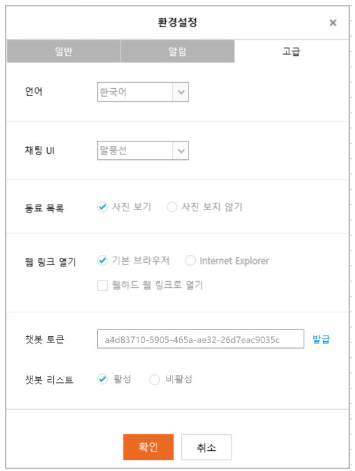

# hiwoker
하이웍스 메신져 챗봇 서버 소스입니다. 

## Installation
```
pip install hiworker
```

## Usage

0. API Key 발급 [하이웍스 메신져](https://www.hiworks.com/cs/download)에서 APIKey를 받을 받을 수 있습니다.


1. API Key 등록 및 서버 생성
```python
server = hiworksBotServer('a4d83710-5905-465a-ae32-26d7eac9035c')
```

2. Guide 생성
```python
def makeBugGuide():
    guide = GuideToken('bug', '/버그')
    commandToken = UserCommandToken('bug', '%버그 발생 시점 및 현상%')
    commandToken.contentOnly = True

    guide.userCommandTokens = [commandToken]
    return guide
```

3. Guide 등록
```python
server.setGuides(makeBugGuide())
```

4. Http Handler 등록
```python
server.addHandler('bug', bug)

def bug():
    print(request.json['key'])
    return '버그 접수 되었습니다.'
```

5. Sample
```python
from Hiworks import *

def makeBugGuide():
    guide = GuideToken('bug', '/버그')
    commandToken = UserCommandToken('bug', '%버그 발생 시점 및 현상%')
    commandToken.contentOnly = True

    guide.userCommandTokens = [commandToken]
    return guide
    
def makeGuides():
    guides = []
    guides.append(makeBugGuide())
    
    return guides

def run():
    server = hiworksBotServer('a4d83710-5905-465a-ae32-26d7eac9035c')
    server.setGuides(makeGuides())

    server.addHandler('bug', bug)
    server.run()

def bug():
    print(request.json['key'])
    return '버그 접수 되었습니다.'

run()
```

